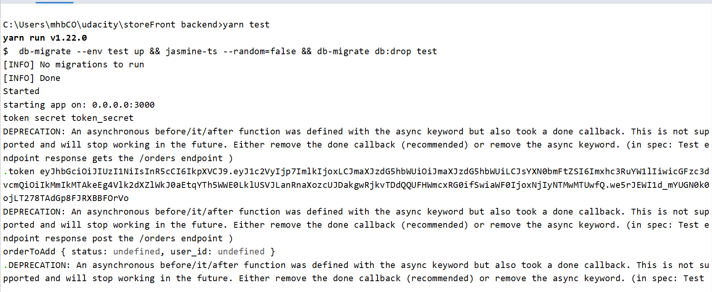
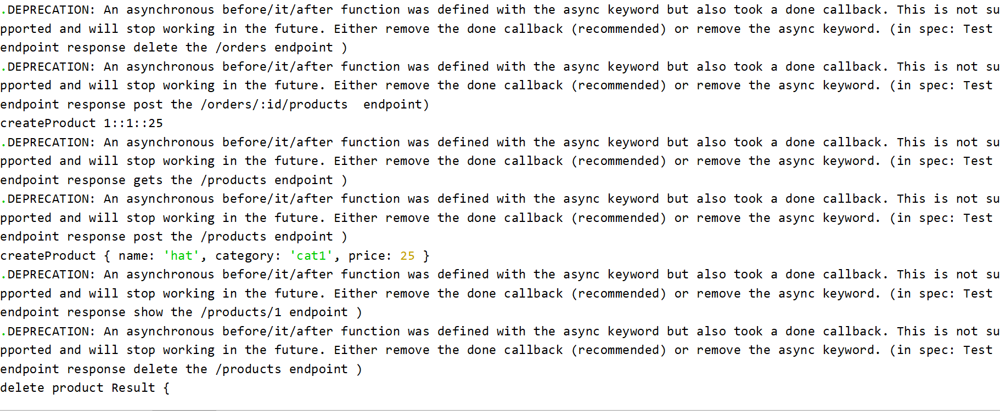
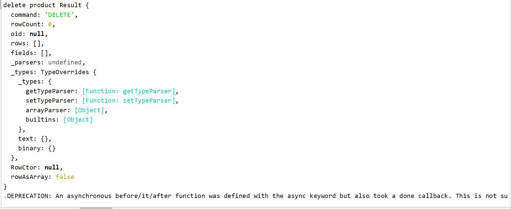
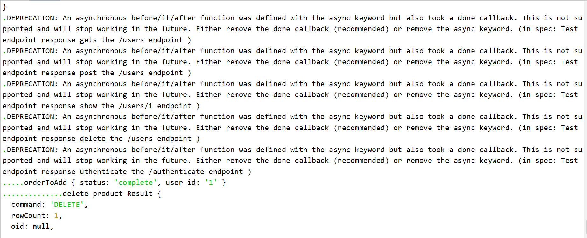
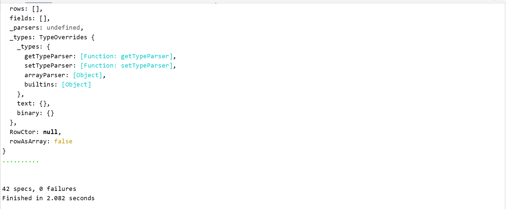

# Storefront Backend Project

## Getting Started

This repo contains a basic Node and Express app to get you started in constructing an API. To get started, clone this repo and run `yarn` in your terminal at the project root.

## Installation
- clone project
- run the command line (yarn install)

## Set up Database
### Create Databases
We shall create the dev and test database.

- connect to the default postgres database as the server's root user `psql -U postgres`
- In psql run the following to create a user 
    - `CREATE USER user1 WITH PASSWORD 'password';`
- In psql run the following to create the dev and test database
    - `CREATE DATABASE storefront;`
    - `CREATE DATABASE storefront_test;`
- Connect to the databases and grant all privileges
    - Grant for dev database
        - `\c storefront`
        - `GRANT ALL PRIVILEGES ON DATABASE storefront TO user1;`
    - Grant for test database
        - `\c storefront_test`
        - `GRANT ALL PRIVILEGES ON DATABASE storefront_test TO user1;` 
## Enviromental Variables Set up
Bellow are the environmental variables that needs to be set in a `.env` file. 
This is the default setting that I used for development, but you can change it to what works for you. 
```
POSTGRES_HOST=localhost
POSTGRES_DB=storefront
POSTGRES_TEST_DB=storefront_test
POSTGRES_USER=user1
POSTGRES_PASSWORD=password
ENV=test
BCRYPT_PASSWORD=udacity-full-javascript
SALT_ROUNDS=10
TOKEN_SECRET=token_secret
```
### Migrate Database
Navigate to the root directory and run the command below to migrate the database 
`db-migrate up`
## Start App
`yarn watch` or `npm run watch`


### Running Ports 
After start up, the server will start on port `3000` and the database on port `5432`
## Endpoint Access
All endpoints are described in the [REQUIREMENT.md](REQUIREMENTS.md) file. 

## Token and Authentication
Tokens are passed along with the http header as 
```
Authorization   Bearer <token>
```
## Testing
Run test with 

`yarn test`

It sets the environment to `test`, migrates up tables for the test database, 
run the test then migrate down all the tables for the test database. 





### Environment Variables
Environment variables are set in the `.env` file and added in `.gitignore` so that it won't be added to github. However, I had provided the names of the variables that need to be set above. I also provided the values that were used in development and testing. 
